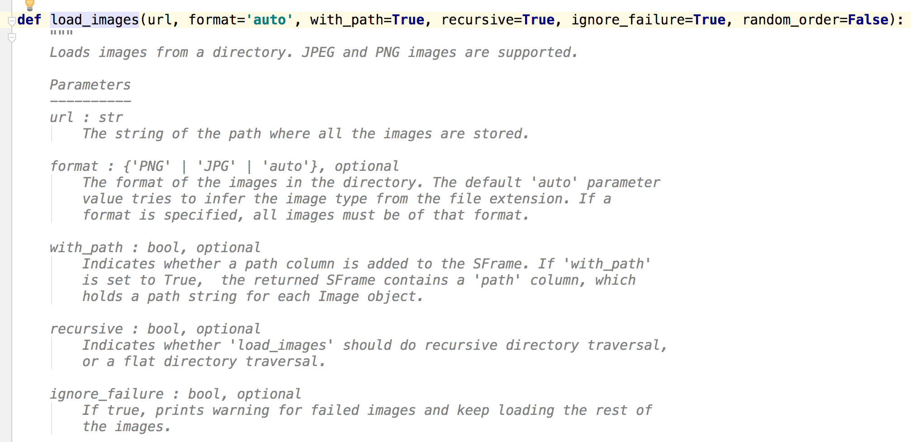
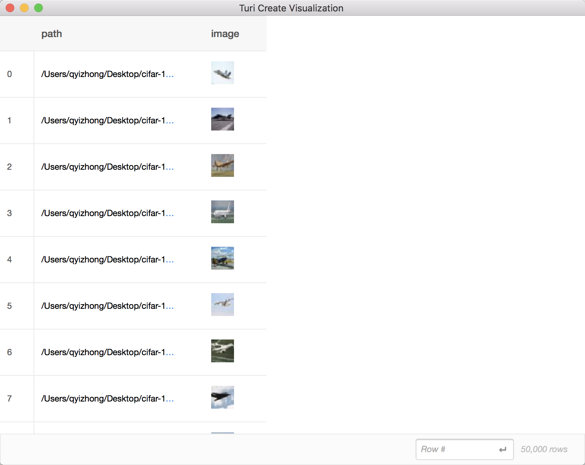
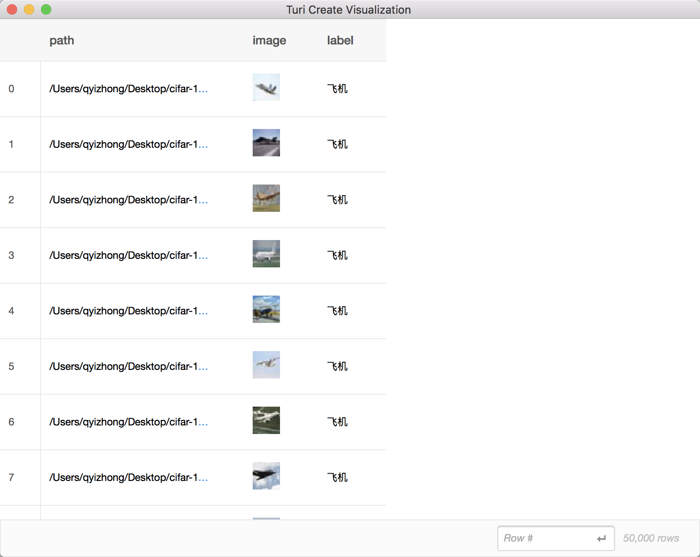
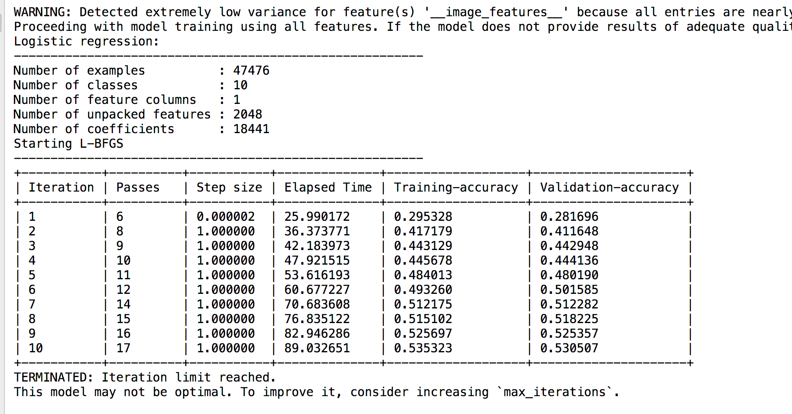
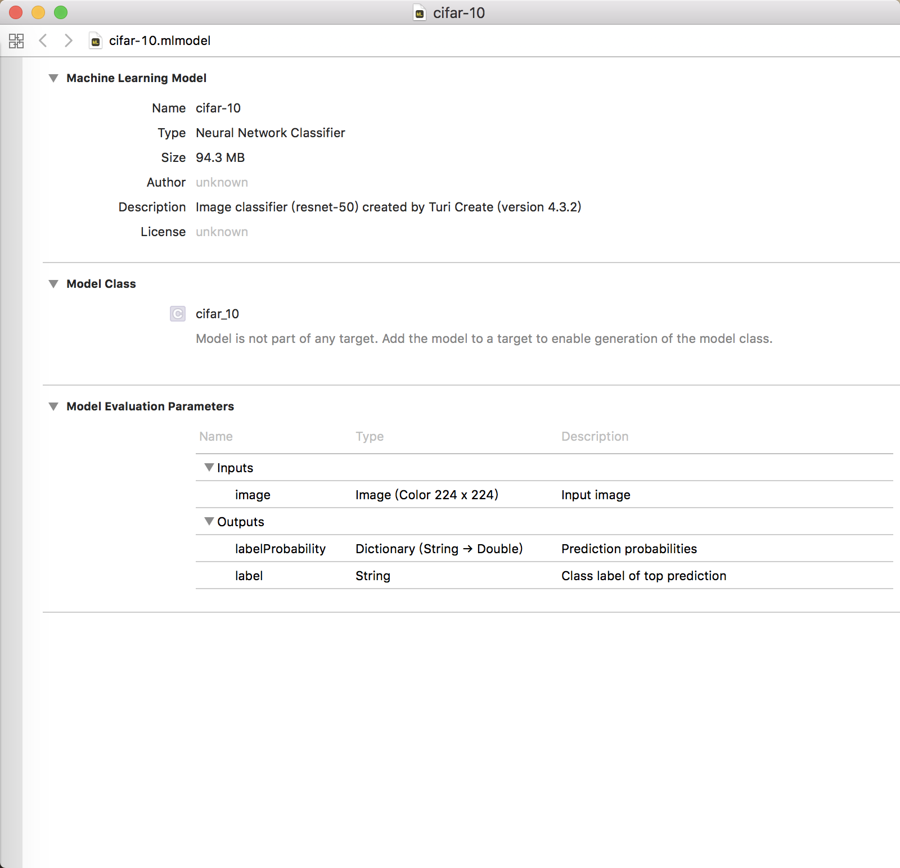

# cifar-10-turicreate

我之前一直都是通过tensorflow训练模型再通过tfcoreml转换成mlmodel使用，这样做中间的过程是非常的复杂，还需要把输入输出用coremltools做对应的转换，偶然之间我发现了turicreate这个库，使用之后感觉体验是非常的棒，简直是我等iOS开发者的福音

先放上turicreate的[API文档](https://apple.github.io/turicreate/docs/api/index.html)

这个东西其实中文资料并不多，使用起来还得靠看文档摸索，但是这里面的API调用起来非常方便，比起tensorflow是使用感觉又好上了不少，因为不需要考虑网络的结构。但是我这次训练完的模型与测试集作比较的准确率只有0.5312，暂时还不知道是哪里出现了问题导致这么低的准确率，有可能是迭代次数不够多

[cifar-10下载地址](https://www.cs.toronto.edu/~kriz/cifar.html) 没有的同学先下载一下

下载下来的数据集是二进制的

我们要了解一下turicreate是如何加载图片的

首先

	import turicreate as tc
	
根据官方文档，有个方法叫

    image_analysis.load_images()
	
点到方法里看一下注释

这里注释写得很清楚，要求加载的图片是JPEG和PNG（.jpg也是可以的），放在一个文件夹里加载，比如
 
    data = tc.image_analysis.load_images('train', with_path=True)

既然知道我们要用jpg或者png格式的图片，那cifar-10的二进制显然不能满足我的需求，所以我们需要先把他转化为jpg格式

    from scipy.misc import imsave
    import numpy as np

    # 解压缩，返回解压后的字典
    def unpickle(file):
        import pickle
        fo = open(file, 'rb')
        dic = pickle.load(fo, encoding='bytes')
        fo.close()
        return dic

    # 生成训练集图片，如果需要png格式，只需要改图片后缀名即可。
    for j in range(1, 6):
        dataName = "cifar-10-batches-py/data_batch_" + str(j)
        Xtr = unpickle(dataName)
        print(dataName + " is loading...")
        for i in range(0, 10000):
            # Xtr['data']为图片二进制数据
            img = np.reshape(Xtr[b'data'][i], (3, 32, 32))
            # 读取image
            img = img.transpose(1, 2, 0)
            # Xtr['labels']为图片的标签，值范围0-9，本文中，train文件夹需要存在，并与脚本文件在同一目录下。
            picName = 'train/' + str(Xtr[b'labels'][i]) + '_' + str(i + (j - 1)*10000) + '.jpg'
            imsave(picName, img)
        print(dataName + " loaded.")

    print("test_batch is loading...")

    # 生成测试集图片
    testXtr = unpickle("cifar-10-batches-py/test_batch")
    for i in range(0, 10000):
        img = np.reshape(testXtr[b'data'][i], (3, 32, 32))
        img = img.transpose(1, 2, 0)
        picName = 'test/' + str(testXtr[b'labels'][i]) + '_' + str(i) + '.jpg'
        imsave(picName, img)
    print("test_batch loaded.")

这段代码是我从网上找来的，来自[代码](https://blog.csdn.net/guohuifengby/article/details/62424299)，注释也写得很清楚，改改就可以用了（我懒得写...）

好了跑完这段代码以后你的train和test文件夹下就都是jpg格式的图片了

接着你就可以如愿以偿的使用

    tc.image_analysis.load_images()

那接着就是看看数据集长啥样咯，所以

    data.explore()

两列，50000行，都加载进来了

光有这两列肯定是不够的还需要一列label，这个表叫做SFrame，列就是SArray了，所以我们需要一个SArray类型的数据加到SFrame里。

那首先还是得把每张图对应的label给标上对吧，之前我们生成jpg格式的图片的时候命名下划线前的是类别，根据cifar-10提供的10个类别，我对每个图片都做了一次判断存到了list里

    label = []
    data_path = data['path']
    for i in range(0, len(data_path)):
        path = data_path[I]
        if "0_" in path:
            label.append("飞机")
        elif "1_" in path:
            label.append("汽车")
        elif "2_" in path:
            label.append("鸟")
        elif "3_" in path:
            label.append("猫")
        elif "4_" in path:
            label.append("鹿")
        elif "5_" in path:
            label.append("狗")
        elif "6_" in path:
            label.append("青蛙")
        elif "7_" in path:
            label.append("马")
        elif "8_" in path:
            label.append("轮船")
        elif "9_" in path:
            label.append("卡车")
    label_array = tc.SArray(data=label, dtype=str)

data就是加载完图片的SFrame，然后我先获取了data['path']这一列，拿到路劲，通过字符串包含关系判断这个图片是哪个类别（我怀疑就是这里出了问题导致准确率极低），这么做其实挺傻的，应该会有更好的办法

通过tc.SArray()就可以把list转成SArray了

接着

    data = data.add_column(data= label_array, column_name='label')

就可以把这一列加载进去了，来看看效果

好了，加载进去了

我们使用

    data.save('cifar-10.sframe')

就可以把SFrame保存起来，下次直接

    data = tc.load_sframe('cifar-10.sframe')

即可

接下来就是训练模型了

    model = tc.image_classifier.create(data, target='label')

因为我们是图像分类，所以使用tc.image_classifier.create，过程长这样

我用MacBook Pro跑的，加测试集跑了4个多小时...

别忘了保存模型

    model.save('cifar-10_model')

跑完之后就是跟测试集做比较，测试集生成的过程我就略过了

    result = model.evaluate(test_data)
    print(result['accuracy'])

这样就可以看你的准确率了

导出成mlmodel

    model.export_coreml('cifar-10.mlmodel')
    

